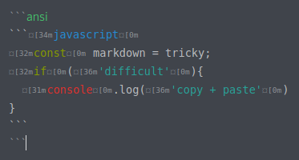
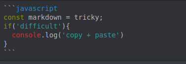

# 100Devs-Discord-Help `(Work in progress)`

Unsanctioned supplemental files and information for the 100Devs Discord help channels.

## Table of contents

Asking questions in the Discord
    * How do I ask my question?
    * Searching for previous answers.
    * Best time to ask?
    * What about voice chat?
    * What are code blocks?


[Frequently Asked Questions(coming soon!)](#)
  * How do I join catch-up crew?
  * What is a thread? and how does it work?
  
  
Answering questions
  * [Code Blocks for pros](#code-blocks-and-syntax-highlighting)

  
  


## Asking questions in the Discord

### How do I ask my question?

### Searching for previous answers.

### Best time to ask?

### What about voice chat?

### What are code blocks?

````
```[language]
  [code]
```
````

##

### Code Blocks and Syntax highlighting

In standard Pandoc Markdown you can demonstrate to viewers how code blocks are created by nesting a triple-backticked code block within a quadruple-backbacked code block

<!--- Note: If you are viewing this file in raw mode please realize that I am using an additional layer of codeblocks in order for GitHub to create this README--->
`````
````
```[language]
  [code]
```
````
`````

Discord Markdown requires that you insert a Zero Width Space (U+200B) within any triple-backticks you wish to escape
````
```             //normal triple-backtick
`​``[language]   //escaped triple-backtick (No visible difference due to the Zero Width Space.)
  [code] 
`​``
```
````

## Applying syntax highlighting 
When specifying the [language] in a code block Discord will normally apply syntax highlighting. This highlighting is lost when using nested code blocks. You can manually apply syntax highlighting in your code block using ANSI syntax in your markdown.

<p>This code...</p>

````
```ansi
`​``javascript
const markdown = tricky;
if('difficult'){
  console.log('copy + paste')
}
`​``
```
````

<p>which looks like this when editing in Discord...</p>

<p>will display as this to other users.</p>

<p>Using ansi color in examples will help the viewer to understand why the [language] is included after the triple-backticks.</p>

*Alternately you could just include a screenshot every time, but that seems very wasteful.*
