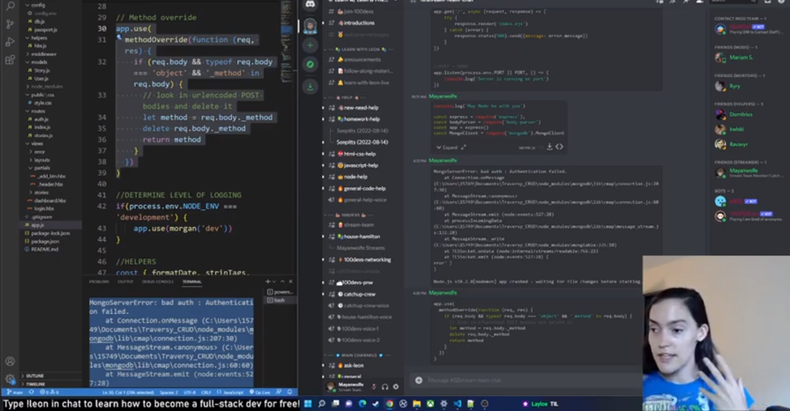
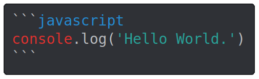
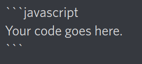

# 100Devs-Discord-Help `(Work in progress)`

Unofficial resources for the **#100Devs** Discord help channels. This is merely a guide for suggested best practices as agreed upon by a small group of members. For official **#100Devs** infomation and resources please visit [leonnoel.com/100devs (external link)](https://leonnoel.com/100devs/)

## Table of contents

### Getting started - [Asking questions in the #100Devs Discord](#asking-questions-in-the-100devs-discord)
  * [How do I ask my question?](#how-do-i-ask-my-question)
  * [Searching for previous answers](#searching-for-previous-answers)
  * [Best time to ask questions.](#best-time-to-ask-questions)
  * [What are code blocks?](#what-are-code-blocks)
  * [More ways to get help](#more-ways-to-get-help)


### [Frequently Asked Questions](#)
  * How do I join catch-up crew?
  * What is a thread? and how does it work?
  * Why is no one answering my question?
  
  
### Answering questions
  * [How can I help?](#how-can-i-help)
  * [Finding questions to answer](#finding-questions-to-answer)
  * [Code Blocks for 'pros'](#code-blocks-for-pros)

  
  


## Asking questions in the #100Devs Discord

For a full comprehensive video tutorial watch Mayanwolfe's excellent guide on YouTube.   


[Mayanwolfe guide to asking questions in the Discord (external link) *(skip to 1:21:40)* ](https://youtu.be/x-kOAl38MBo?t=4900)
### How do I ask my question?
#### The Process:
1. Pick a relevant help channel.
1. Type your question and press enter.
1. The needle bot will open a new thread for you **'automagically.'**
1. Paste any related code, code snippets, and/or images **inside** this new thread.
1. Wait patiently... 

Eventually someone should come around. They may ask you for additional info and then try to help you work through the problem.

**After** your question has been answered give a quick thanks and press the green **'archive thread'** button at the top of the thread.

<sub>💡The 'archive thread' button makes it easier for volunteers to find more unanswered questions.</sub>

### Searching for previous answers.
Press `Ctrl+F` and start typing to search. (On mobile devices tap the 🔎 magnifying glass icon on the top right of the screen) 

There are several filters you can use to narrow your search. Try typing `in:` and the name of a channel to display only the search results from that channel or `from:` and a username to display all of the messages from a particular user. 

💡 There are many more powerful tools you can use in search. For more in-depth information check out the [Discord guide to using search (external link)](https://support.discord.com/hc/en-us/articles/115000468588-Using-Search)

### Best time to ask questions
Any time you find yourself stuck on something for more than 20 minutes is the best time to hop on Discord and ask questions. However the amount of active members in the help channels varies greatly throughout the day and also from week to week.

### What are code blocks?
One of Discord's features is that it uses 'Markdown' syntax to display text. You can surround the code you type in chat with backticks and it will be displayed in a way that is easier for other developers to read.

Using three backticks in a row will create a multi-line code block. Type the name of the language you are using directly after the first triple-backtick to use syntax highlighting.



````
```[type the language here]
[paste your code here]
```
````

> 💡 Use single backticks to display `` `inline code` `` (single line, no color)  

### More ways to get help

#### Study groups
If you are a member of a local or affinty study group you can start your own thread in the group and try asking your question there.

#### Using Search
> Please see ['Searching for previous answers'](#searching-for-previous-answers)

#### Voice chat
Sometimes the fastest way to get your question answered is to join a voice chat and ask for help directly. You can also go into an empty voice chat and start sharing your screen and folx will show up out of curiosity. 

## Frequently Asked Questions

### How do I join catch-up crew?

### What is a thread? and how does it work?
TLDR - A thread is basically a mini channel inside a main channel used to focus on a single topic. Messages sent inside the help channels are automatically transformed into a thread by the 'Needle Bot.'

> 💡 For more in-depth information on how Discord threads work check out the official [Discord threads FAQ (External link)](https://support.discord.com/hc/en-us/articles/4403205878423-Threads-FAQ)

## Answering questions

### How can I help?
>“If you have come here to help me, you are wasting your time. But if you have come because your liberation is bound up with mine, then let us work together.”<sub> -Lilla Watson</sub>


The easiest way to get started is to just browse the help channels and look for "easy" questions to answer. 
💡 Advanced coders that aren't currently watching the live classes should try to at least know the basic gist of the various homework assignments. 


### Finding questions to answer

### Code blocks for 'pros'

Users not familiar with Markdown may be unaware that they can display their code using code blocks in Discord. 

#### Showing users how to create codeblocks

An easy way to show users how to create a code block is to type a short example code block and then escape the triple backticks with a backslash. This will display as a plaintext message in Discord without hiding the backticks:



💡 Try pasting this code into a Discord message:
```
\```javascript
Your code goes here.
\```
```